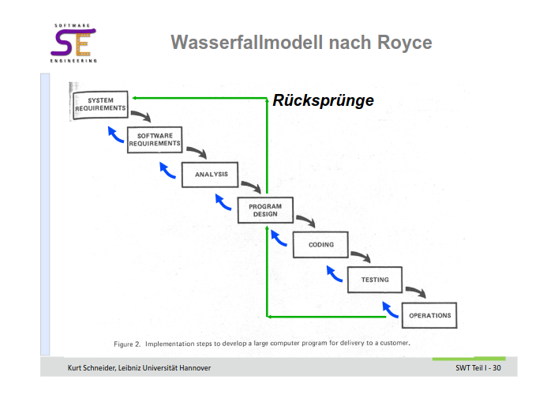

# Assignment 1
## Aufgabe 1

## Aufgabe 2
**Wasserfallmodell nach Royce**

- **allg. Beschreibung**: Vorgehensmodell, dass die Entwicklungsprozess von Software in Phasen unterteilt. Der Fluss des Modells ist linear, jedoch sind Rücksprünge in die vorherige Phase erlaubt.

- **Reihenfolge der Phasen**: 
  1. System Requirements
  2. Software Requirements
  3. Analysis
  4. Program Design
  5. Coding
  6. Testing
  7. Operations

- **Bedeutung der Pfeile**: Peile geben an, welche Phase nach abschluss einer Phase folgt. Rückführende Pfeile zeigen, dass es möglich ist in eine vorherige Phase zurück zu kehren.

- **möglicher Grund für Rücksprung**: Während des testen werden Fehler gefunden die in Coding behoben werden müssen. Während Coding zeigt es sich, dass System Requirements falsch eingestuft wurden.

## Aufgabe 3
### a
**Die 5 Ingenieursprinzipien**

1. Kostendenken - *Kein Perfketionismus* 
2. Qualitätsbewusstsein - *'es läuft' reicht nicht*
3. Anwendung von Regeln und Normen - *keine Künstler*
4. Probleme durch Zerlegung lösen - *divide et impera*
5. Baugruppen und Wiederverwertung - *statt 'not invented here'*

### b

1. **Kostendenken**: häufig ist es nicht nötig Zeit und Geld darauf zu verwenden einen schnellere oder effizientere Implementation zu finden, (aka. premature optimization) da Rechenleistung günstig ist oder diese Faktoren nicht kritisch sind. Es ist besser diese Resourcen auf die wichtigen Aspkete zu verwenden.
2. **Baugruppen und Wiederverwertung**: bestimmte Bausteine oder Funktionalitäten sollten, wenn nicht zwingend nötig, nicht selbst implementiert werden. Das verwenden von bereits bestehenden Lösungen spart Zeit und Geld. Außerdem bestehen diese meist seit einer längeren Zeit und wurden bereits von anderen verwendet. Dadurch entsteht i.d.R. eine höhere Qualität und Zuverlässigkeit.

## Aufgabe 4

