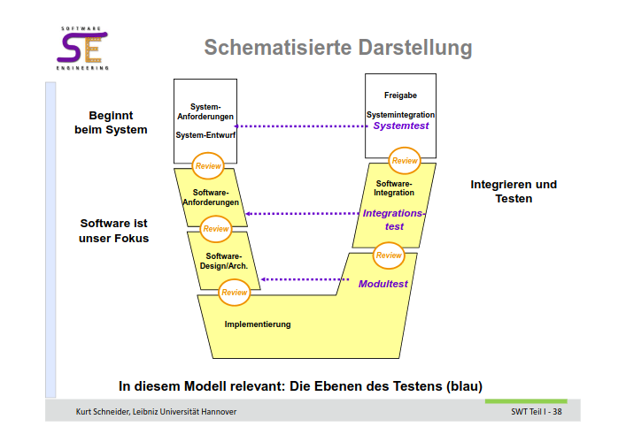
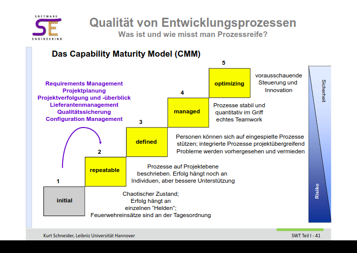

# Assignment 2
## Aufgabe 1
**V-Modell**

### a
- Review: Prüfung durch lesen durch Anderer, die Unstimmigkeiten finden sollen.
- Testen: Es wird überprüft ob der Implementierte Teil den Anforderungen entspricht, die formuliert wurden.

### b
ohne zu testen, ob die Software den Anforderungen entspricht läuft man in Gefahr ein nicht funktionsfähiges Produkt zu entwickeln oder eines, welches nicht das tut was es tun soll. Folgen davon sind Vertrauensverlust mit dem Kunden und/oder steigende Kosten, da nun umständlich das Produkt angepasst werden muss.

## Aufgabe 2
**Capability Maturity Model**

### a
1. Initial
2. repeatable
3. defined
4. managed
5. optimizing

### b 
...

## Aufgabe 3
**'Working software over comprehensive documentations'**

Teil des Agile Manifesto.

*Individuals and interactions **over** processes and tools
Working software **over** comprehensive documentation
Customer collaboration **over** contract negotiation
Responding to change **over** following a plan*

### a
sagt aus, dass funktionierende softwar über Dokumentation priorisiert werden sollte. Heißt nicht, dass keine Dokumentation nötig ist, sondern dass dort Dok. schreiben soll wo absolut nötig. Gerade am Anfang eines Projekt sollte Dokumentation zurückgestellt werden, da diese zum ende bereits überholt sein könnte. 

### b
Vorteil: 

Nachteil:

## Aufgabe 4
### a
**Lastenheft**

Beschreibt gesamte Funktionalität die eine Software erfüllen soll. Ist daher Grundlage von Angeboten. Ist Basis zur Erstellung des Pflichtenhefts. 

**Plfichtheft**

Stellt Softwarelösung des Anbieters dar und beschreibt wie Anforderungen umgesetzt werden. Elementare Arbeitsgrundlage des gesamten Projekts. 

### b

**Neues Thema erstellen**

ne

## Aufgabe 5
**V-Modell vs. inkrementelle Entwicklung**

Inkrementelle Entwicklung: 

Entwicklung in Bausteinen mit einer groben Vision. Jeweils nur ein Baustein detailliert, die anderen nicht sehr genau. 
Ziel ist, dass jedes Inkrement vollständig einsetzbar ist, daher sind spätere Inkremente Ausbaustufen. Inkremente immer im gleichen Zeittakt. Kunde kann so Produkt häufig nutzen und feedback geben. 

Dagegen wird beim V modell der gesamte Umfang geplant. Es vergeht viel Zeit bevor etwas handfestes entsteht. Der Kunde kann das Problem nur theoretisch verfolgen und erhält nur zum Ende ein nutzbares Produkt.