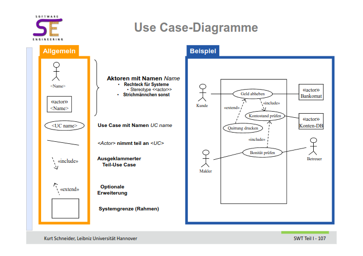

# Assignment 4

## Aufgabe 1

Requirement Engineering: 

Prozess des Definieren, Dokumentieren und Maintainen der Anforderungen im design prozess der software/system. 

### a

- Elicitation: "herauskitzeln" von Anforderungen, indem Stakeholder identifiziert werden und im Gespräch (Interviews, workshops, fragebögen) definiert werden. Danach veredelung der Rohanforderungen.

- Interpretation: Anforderungen werden inhaltlich bearbeitet. (Interpretation kann falsch sein). Anforderungen werden strukturiert, detailliert und auf das essentielle heruntergebrochen. 

- Negotation: Es werden Abhängigkeiten zwischen den Anforderungen identifiziert und Widersprüche aufgedeckt. Bei Konflikten muss eine Lösung durch Verhandlung gefunden werden. 

- Dokumentation: Anforderungen müssen fixiert werden, dürfen sich jedoch imer laufe der Zeit ändern. Wichtig auch Gesprächspartner, Rollen etc zu dokumentieren. 

- Validierung und Verifikation: durch Validierung wird überprüft ob die im Entwurf enthaltenen Anforderungen auch wirklich die des Kunden sind (Befragung, Interview, Nachprüfung), während bei der Verifikation überprüft wird ob der Entwurf auch der Spezifikation entspricht. (Formale Verfahren, Konsistenzprüfung)

### b 

- Change Management: bewasst sich mit Änderungswünschen gegenüber der software. Festhalten der Änderung und der Gründe führt zu einer Historie.

- Tracing: Weitergeben der Änderungen, daher, dass Änderungen and abhängige Anforderungen überwacht werden und festgestellt wird ob diese beeinflusst sind. 

## Aufgabe 2 

[R01]: Registrierung mit Email und Passwort (Funktional)  
[R02]: Einfache, übersichtliche und farbliche Oberfläche (nicht-funktional)  
[R03]: Soll erstmals Dezember 2030 getestet werden (Projekt/Prozessanforderung)  
[R04]: Verwendbar als mobile Website und App (Constraint)  

## Aufgabe 3

### a 

**placeholder**

### b

Beschreibt den Umfang der Software der von dem Entwickler berücksichtig werden muss. 

## Aufgabe 4

verschiedene Stile von textbasierten User Stories: 

- Narrative:  
Kurze "geschichte" die das Produkt beschreibt.

- Brief / Kurzzusammenfassung:  
Zusammenfassung, oft des Haupt-Erfolgsszenarios

- Casual / informell:  
Mehrere informelle geschriebene Absätze, darin mehrere Abläufe

- Fully dressed / detailliert:  
am detailliertesten. In Tabellenform sind alle Schritte und Varianten ausgeführt. 

### a 

- Akteure / Actors:  
    - außerhalb der Systemgrenzen 
    - Interagiert mit dem System im Rahmen der Use Cases
    - Hauptakteur: der, dessen Ziel erreicht werden soll  

- Stakeholder:
    - Jemand mit Interesse am Use case. Muss nicht zwingend daran teilnehmen.
    - Wer ist das? Fertigkeiten, Aufgaben etc in separate Tabelle

- Systemgrenze / Scope:
    - Was gehört noch zum modellierten System, was nicht mehr ? 

- (Miss)Erfolgsfall:
    - Wenn der gewünschte Fall (nicht) eintritt. 

- Garantie: 
    - Was man auch im Misserfolg sicherstellen kann.

### b

ne
