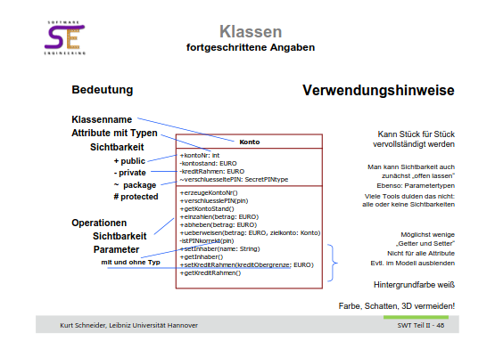
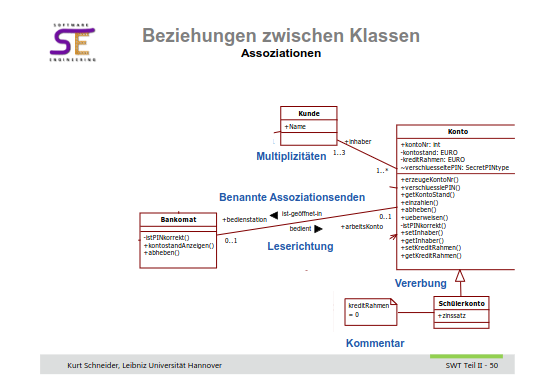
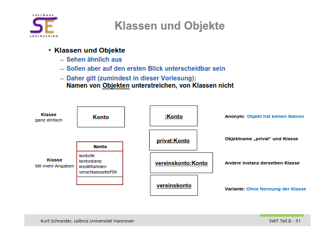
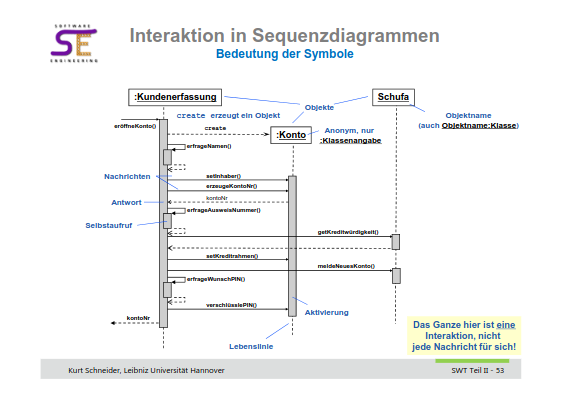
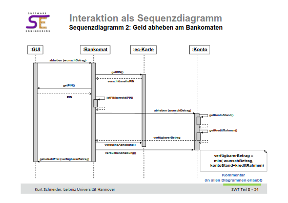

# Assignment 7

## Aufgabe 1

### a

durch Inheritance. Seminare etc. sind Arten des gleichen Typen (Kurs) und teilen Gewisse Member-Variablen wie Namen oder Kursnummer. Funktionen auf Kursen wie das Verfassen einer Evaluation sind müssen auch nicht unterschiedlich zwischen den Kind Klassen implementiert werden. 

### b

placeholder  

## Aufgabe 2

placeholder

## Aufgabe 3 

Bei Information Hiding wird nur das von einer Einheit (Klasse, Methode, API etc.) preisgegeben, das zwingend nötig ist. Dabei werden Informationen die beschreiben *wie* etwas funktioniert verborgen. Stattdessen wird nur gezeigt *was* ein Einheit tut. Bpsw. eine Methode zum Sortieren eines Arrays. Die Art des Sortierungsalgorithmus wird verborgen. Würde man Information Hiding nicht betreiben, käme es zu Problemen. Zum einen verhindert Information Hiding Funktionen, für deren Nutzung der User umfangendes Wissen und Verständniss für die Funktionsweise mitbringen muss. Besser ist es eine Funktion so zu gestalten, dass der User kaum bis gar kein eigenes Wissen mitbringen muss. Bspw. muss der User den Algorithmus nicht verstehen. Außerdem hilft Information Hiding dabei bestehende Einheiten zu refactorn. So kann der genutze Algorithmus oder Datentyp ausgetauscht werden, solange die user facing API gleich bleibt. In Java würde man dies mit einem Interface realisieren. Diese deklarieren die Methoden lediglich, überlasse die Definition, jedoch der Implementierenden Klasse (Sie erfordern dies sogar).