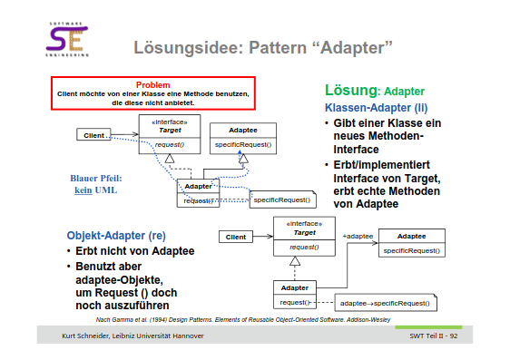
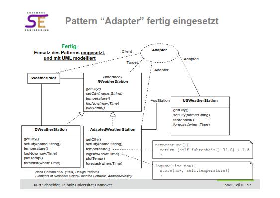

# Assignment 8

## Aufgabe 1

### a 

Ein Adapter ermöglich es Methoden aufzurufen, welche nicht in der gewünschten Form in der Klasse vorliegen. Bspw. hat eine Klasse eine Methode welche the Temperatur in Fahrenheit widergibt. Man benötigt jedoch Celsius. Ein Adapter kann die benötigte Methode implementieren und übernimmt die Umformung von Fahrenheit zu Celsius intern. Für den französischen Webservice kann der Adapter die Übersetzung aus den verschiedenen Sprachen ins Französische übernehmen. 

### b

später

## Aufgabe 2

### a

Strukturen sind ein Composite aus atomaren Einheiten (Zimmer) und weiteren Composites (Trakte). Die gleichen Operationen auf atomaren Einheiten und Composites müssen unterschiedlich gehandhabt werden. Gibt es einen Alarm muss ein Zimmer den Bewohner informieren, ein Trakt muss jedoch die Zimmer in seiner Liste answeisen jeweils die Bewohner zu informieren. Durch Das Composite Pattern können sowohl Zimmer als auch Trakte durch die gleiche Methode angewiesen werden den Alarm auszulösen, verhalten sich jedoch unterschiedlich. 

### b

später
